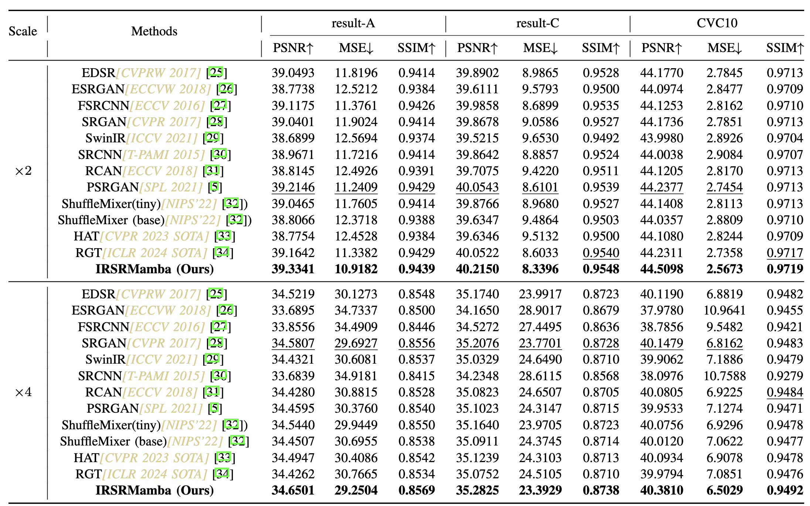

# [IRSRMamba](http://arxiv.org/abs/2405.09873)
Official PyTorch implementation of the paper [IRSRMamba: Infrared Image Super-Resolution via Mamba-based Wavelet Transform Feature Modulation Model.](http://arxiv.org/abs/2405.09873)


## Introduction

Infrared (IR) image super-resolution faces challenges from homogeneous background pixel distributions and sparse target regions, requiring models that effectively handle long-range dependencies and capture detailed local-global information. Recent advancements in Mamba-based (Selective Structured State Space Model) models, employing state space models, have shown significant potential in visual tasks, suggesting their applicability for IR enhancement. In this work, we introduce IRSRMamba: Infrared Image Super-Resolution via Mamba-based Wavelet Transform Feature Modulation Model, a novel Mamba-based model designed specifically for IR image super-resolution. This model enhances the restoration of context-sparse target details through its advanced dependency modeling capabilities. Additionally, a new wavelet transform feature modulation block improves multi-scale receptive field representation, capturing both global and local information efficiently. Comprehensive evaluations confirm that IRSRMamba outperforms existing models on multiple benchmarks. This research advances IR super-resolution and demonstrates the potential of Mamba-based models in IR image processing.

## Approach overview


## Main results



Please check [here.](https://github.com/yongsongH/IRSRMamba/blob/3fb448b0efaa5ded1bd2b878d9535e256f99509f/experiments/pretrained_models/vis.pdf)


## Requirements
> - Python 3.8, PyTorch >= 1.11
> - BasicSR 1.4.2
> - Platforms: Ubuntu 18.04, cuda-11


## Installation
>  Clone the repo
```
git clone https://github.com/yongsongH/IRSRMamba.git
```
> Install dependent packages
```
cd IRSRMamba
```
```
pip install -r install.txt
```
> Install BasicSR
```
python setup.py develop
```
***You can also refer to this [INSTALL.md](https://github.com/XPixelGroup/BasicSR/blob/master/docs/INSTALL.md) for installation***

## Dataset prepare

Please check this [page](https://figshare.com/articles/dataset/IRSRMamba_Infrared_Image_Super-Resolution_via_Mamba-based_Wavelet_Transform_Feature_Modulation_Model/25835938).

## Model

Pre-trained models can be downloaded from this [link](https://figshare.com/articles/dataset/IRSRMamba_Infrared_Image_Super-Resolution_via_Mamba-based_Wavelet_Transform_Feature_Modulation_Model/25835938).

## Evaluation

please check the [log file](https://github.com/yongsongH/IRSRMamba/blob/main/results/0515_SPL_IRSRMamba_Final_x2/test_0515_SPL_IRSRMamba_Final_x2_20240516_171818.log) for more information about the settings.

    
***
Run 
```
  python basicsr/test.py -opt options/test/test_IRSRMamba_SPL_x4.yml
```
```
  python basicsr/test.py -opt options/test/test_IRSRMamba_SPL_x2.yml
```

## Contact

If you meet any problems, please describe them and [contact](https://hyongsong.work/) me. 

**Impolite or anonymous emails are not welcome. There may be some difficulties for me to respond to the email without self-introduce. Thank you for understanding.**

## Acknowledgement
This work is under peer review.
The updated manuscript and training dataset will be released after the paper is accepted.
