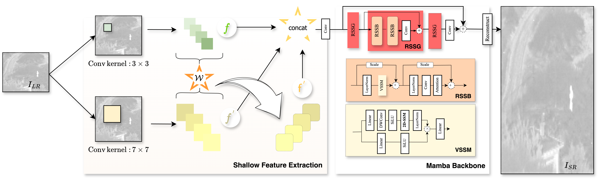

# IRSRMamba
Official PyTorch implementation of the paper IRSRMamba: Infrared Image Super-Resolution via Mamba-based Wavelet Transform Feature Modulation Model.


## Introduction

Infrared (IR) image super-resolution faces challenges from homogeneous background pixel distributions and sparse target regions, requiring models that effectively handle long-range dependencies and capture detailed local-global information. Recent advancements in Mamba-based (Selective Structured State Space Model) models, employing state space models, have shown significant potential in visual tasks, suggesting their applicability for IR enhancement. In this work, we introduce IRSRMamba: Infrared Image Super-Resolution via Mamba-based Wavelet Transform Feature Modulation Model, a novel Mamba-based model designed specifically for IR image super-resolution. This model enhances the restoration of context-sparse target details through its advanced dependency modeling capabilities. Additionally, a new wavelet transform feature modulation block improves multi-scale receptive field representation, capturing both global and local information efficiently. Comprehensive evaluations confirm that IRSRMamba outperforms existing models on multiple benchmarks. This research advances IR super-resolution and demonstrates the potential of Mamba-based models in IR image processing.

## Approach overview



## Main results

| Scale | Methods | result-A |  |  | result-C |  |  | CVC10 |  |  |
| :---: | :---: | :---: | :---: | :---: | :---: | :---: | :---: | :---: | :---: | :---: |
|  |  | PSNR  | MSE | SSIM  | PSNR  | MSE| SSIM   | PSNR  | MSE | SSIM  |
| x2 | EDSR [CVPRW 2017]  | 39.0493 | 11.8196 | 0.9414 | 39.8902 | 8.9865 | 0.9528 | 44.1770 | 2.7845 | 0.9713 |
|  | ESRGAN [ECCVW 2018]  | 38.7738 | 12.5212 | 0.9384 | 39.6111 | 9.5793 | 0.9500 | 44.0974 | 2.8477 | 0.9709 |
|  | FSRCNN [ECCV 2016]  | 39.1175 | 11.3761 | 0.9426 | 39.9858 | 8.6899 | 0.9535 | 44.1253 | 2.8162 | 0.9710 |
|  | SRGAN [CVPR 2017]  | 39.0401 | 11.9024 | 0.9414 | 39.8678 | 9.0586 | 0.9527 | 44.1736 | 2.7851 | 0.9713 |
|  | SwinIR [ICCV 2021]  | 38.6899 | 12.5694 | 0.9374 | 39.5215 | 9.6530 | 0.9492 | 43.9980 | 2.8926 | 0.9704 |
|  | SRCNN [T-PAMI 2015]  | 38.9671 | 11.7216 | 0.9414 | 39.8642 | 8.8857 | 0.9524 | 44.0038 | 2.9084 | 0.9707 |
|  | RCAN [ECCV 2018]  | 38.8145 | 12.4926 | 0.9391 | 39.7075 | 9.4220 | 0.9511 | 44.1205 | 2.8170 | 0.9713 |
|  | PSRGAN [SPL 2021]  | 39.2146  | 11.2409  | 0.9429  | 40.0543  | 8.6101 | 0.9539 | 44.2377 | 2.7454  | 0.9713 |
|  | ShuffleMixer(tiny)[NIPS'22]  | 39.0465 | 11.7605 | 0.9414 | 39.8766 | 8.9680 | 0.9527 | 44.1408 | 2.8113 | 0.9713 |
|  | ShuffleMixer (base) [NIPS'22]  | 38.8066 | 12.3718 | 0.9388 | 39.6347 | 9.4864 | 0.9503 | 44.0357 | 2.8809 | 0.9710 |
|  | HAT [CVPR 2023 SOTA]  | 38.7754 | 12.4528 | 0.9384 | 39.6346 | 9.5132 | 0.9500 | 44.1080 | 2.8244 | 0.9709 |
|  | RGT [ICLR 2024 SOTA]  | 39.1642 | 11.3382 | 0.9429 | 40.0522 | 8.6033 | 0.9540  | 44.2311 | 2.7358 | 0.9717  |
|  | IRSRMamba (Ours) | 39.3341 | 10.9182 | 0.9439 | 40.2150 | 8.3396 | 0.9548 | 44.5098 | 2.5673 | 0.9719 |
| x4 | EDSR CVPRW 2017]  | 34.5219 | 30.1273 | 0.8548 | 35.1740 | 23.9917 | 0.8723 | 40.1190 | 6.8819 | 0.9482 |
|  | ESRGAN [ECCVW 2018]  | 33.6895 | 34.7337 | 0.8500 | 34.1650 | 28.9017 | 0.8679 | 37.9780 | 10.9641 | 0.9455 |
|  | FSRCNN [ECCV 2016]  | 33.8556 | 34.4909 | 0.8446 | 34.5272 | 27.4495 | 0.8636 | 38.7856 | 9.5482 | 0.9421 |
|  | SRGAN [CVPR 2017]  | 34.5807  | 29.6927  | 0.8556  | 35.2076  | 23.7701  | 0.8728  | 40.1479  | 6.8162 | 0.9483 |
|  | SwinIR [ICCV 2021] | 34.4321 | 30.6081 | 0.8537 | 35.0329 | 24.6490 | 0.8710 | 39.9062 | 7.1886 | 0.9479 |
|  | SRCNN [T-PAMI 2015]  | 33.6839 | 34.9181 | 0.8415 | 34.2348 | 28.6115 | 0.8568 | 38.0976 | 10.7588 | 0.9279 |
|  | RCAN [ECCV 2018]  | 34.4280 | 30.8815 | 0.8528 | 35.0823 | 24.6507 | 0.8705 | 40.0805 | 6.9225 | 0.9484  |
|  | PSRGAN [SPL 2021]  | 34.4595 | 30.3760 | 0.8540 | 35.1023 | 24.3147 | 0.8715 | 39.9533 | 7.1274 | 0.9471 |
|  | ShuffleMixer(tiny) [NIPS'22]  | 34.5440 | 29.9449 | 0.8550 | 35.1640 | 23.9705 | 0.8723 | 40.0756 | 6.9296 | 0.9478 |
|  | ShuffleMixer(base) [NIPS'22]  | 34.4507 | 30.6955 | 0.8538 | 35.0911 | 24.3745 | 0.8714 | 40.0120 | 7.0622 | 0.9477 |
|  | HAT [CVPR 2023 SOTA]  | 34.4947 | 30.4086 | 0.8542 | 35.1239 | 24.3103 | 0.8713 | 40.0934 | 6.9078 | 0.9478 |
|  | RGT [ICLR 2024 SOTA]  | 34.4262 | 30.7665 | 0.8534 | 35.0752 | 24.5105 | 0.8710 | 39.9794 | 7.0851 | 0.9476 |
|  | IRSRMamba (Ours) | 34.6501 | 29.2504 | 0.8569 | 35.2825 | 23.3929 | 0.8738 | 40.3810 | 6.5029 | 0.9492 |

Please check [here.](https://github.com/yongsongH/IRSRMamba/blob/3fb448b0efaa5ded1bd2b878d9535e256f99509f/experiments/pretrained_models/vis.pdf)


## Requirements
> - Python 3.8, PyTorch >= 1.11
> - BasicSR 1.4.2
> - Platforms: Ubuntu 18.04, cuda-11


## Installation
>  Clone the repo
```
git clone https://github.com/yongsongH/IRSRMamba.git
```
> Install dependent packages
```
cd IRSRMamba
```
```
pip install -r install.txt
```
> Install BasicSR
```
python setup.py develop
```
***You can also refer to this [INSTALL.md](https://github.com/XPixelGroup/BasicSR/blob/master/docs/INSTALL.md) for installation***

## Dataset prepare

Please check this [page](https://figshare.com/articles/dataset/IRSRMamba_Infrared_Image_Super-Resolution_via_Mamba-based_Wavelet_Transform_Feature_Modulation_Model/25835938).

## Model

Pre-trained models can be downloaded from this [link](https://figshare.com/articles/dataset/IRSRMamba_Infrared_Image_Super-Resolution_via_Mamba-based_Wavelet_Transform_Feature_Modulation_Model/25835938).

## Evaluation

please check the [log file](https://github.com/yongsongH/IRSRMamba/blob/main/results/0515_SPL_IRSRMamba_Final_x2/test_0515_SPL_IRSRMamba_Final_x2_20240516_171818.log) for more information about the settings.

    
***
Run 
```
  python basicsr/test.py -opt options/test/test_IRSRMamba_SPL_x4.yml
```
```
  python basicsr/test.py -opt options/test/test_IRSRMamba_SPL_x2.yml
```

## Contact

If you meet any problems, please describe them and [contact](https://hyongsong.work/) me. 

**Impolite or anonymous emails are not welcome. There may be some difficulties for me to respond to the email without self-introduce. Thank you for understanding.**

## Acknowledgement
This work is under peer review.
The updated manuscript and training dataset will be released after the paper is accepted.
